<!-- ─────────────────────────────  HERO  ───────────────────────────── -->

  

  <samp>
    <a href="https://soyrage.es">soyrage.es</a>&nbsp;&nbsp;·&nbsp;&nbsp;
    <a href="mailto:contact@soyrage.es">contact@soyrage.es</a>&nbsp;&nbsp;·&nbsp;&nbsp;
    <a href="https://www.youtube.com/@SoyRage">youtube</a>&nbsp;&nbsp;·&nbsp;&nbsp;
    <a href="https://www.tiktok.com/@soyrageagency">tiktok</a>
  </samp>

 

<!-- ─────────────────────────────  ABOUT  ──────────────────────────── -->

  

 

<!-- ─────────────────────────────  STACK  ──────────────────────────── -->
<h2 align="center">⌗&nbsp;&nbsp;TECH STACK</h2>

<samp>‹ LANGUAGES ›</samp>

  

<samp>‹ FRONTEND ›</samp>

  

<samp>‹ BACKEND & APIS ›</samp>

  

<samp>‹ DATABASES & CACHING ›</samp>

  

<samp>‹ CLOUD ›</samp>

  

<samp>‹ DEVOPS & INFRASTRUCTURE ›</samp>

  

<samp>‹ OBSERVABILITY & MESSAGING ›</samp>

  

<samp>‹ TOOLS ›</samp>

  

 

<!-- ───────────────────────────  ANALYTICS  ────────────────────────── -->
<h2 align="center">⌗&nbsp;&nbsp;ANALYTICS</h2>

  
  

 

  

 

  <picture>
    <source media="(prefers-color-scheme: dark)" srcset="https://raw.githubusercontent.com/soyrageagency/soyrageagency/output/github-contribution-grid-snake-dark.svg"/>
    <source media="(prefers-color-scheme: light)" srcset="https://raw.githubusercontent.com/soyrageagency/soyrageagency/output/github-contribution-grid-snake.svg"/>
    
  </picture>

 

<!-- ─────────────────────────  SELECTED WORK  ──────────────────────── -->
<h2 align="center">⌗&nbsp;&nbsp;SELECTED WORK</h2>

<table align="center" width="100%">
  <tr>
    <td width="26%" align="left"><samp><b><a href="https://soyrage.es">SoyRage Agency&nbsp;↗</a></b></samp></td>
    <td width="50%" align="left">Premium digital agency — product, brand & engineering under one roof.</td>
    <td width="24%" align="right"><code>Next.js</code> <code>Node</code> <code>Tailwind</code></td>
  </tr>
  <tr>
    <td align="left"><samp><b><a href="https://plenix.net">PlenixNetwork&nbsp;↗</a></b></samp></td>
    <td align="left">High-performance hosting — VPS, game servers & managed infrastructure.</td>
    <td align="right"><code>Proxmox</code> <code>K8s</code> <code>Ansible</code> <code>Nginx</code></td>
  </tr>
  <tr>
    <td align="left"><samp><b><a href="https://preview.comty.app/account/soyrage">Comty&nbsp;↗</a></b></samp></td>
    <td align="left">Open-source social platform built for creators, with friends.</td>
    <td align="right"><code>React</code> <code>Node</code> <code>MongoDB</code> <code>WS</code></td>
  </tr>
</table>

 

<!-- ─────────────────────────────  CONTACT  ────────────────────────── -->
<h2 align="center">⌗&nbsp;&nbsp;CONTACT</h2>

  &nbsp;
  &nbsp;
  &nbsp;
  &nbsp;
  

 

<!-- ─────────────────────────────  FOOTER  ─────────────────────────── -->

  

